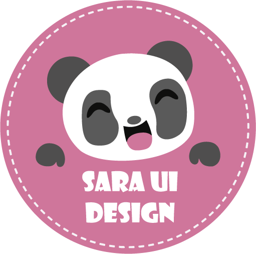

# Sara UI Design 2.0.0

**Manual de uso de la biblioteca de controles para Windows Forms**  
Cristóbal Rodas · PanditaDev  
Edición técnica basada en el código del commit `48c838f`.

> Donde el código se encuentra con el arte, las ideas cobran vida.



<!-- PAGEBREAK -->

## Dedicatoria

A ti, princesa de vestidos largos y rizos en cascada, con dos zafiros color café en la mirada y una voz que aún recuerdo.

Creé esta biblioteca cuando quise ayudarte a descubrir la programación sin dejar atrás el arte, la música, los libros ni la poesía que forman parte de ti. Quería que pudieras construir interfaces donde también hubiera espacio para crear y expresarte.

Hoy comparto Sara_UI_Design 2.0.0 gratuitamente con la esperanza de que te sirva a ti y a otras personas que quieran darle vida y belleza a sus ideas.

Con cariño,  
**Cristóbal Rodas · PanditaDev**  
*Tu Pandita Feliz*

<!-- PAGEBREAK -->

## Cómo utilizar este manual

Esta guía explica para qué sirve cada familia de controles, cómo instalarla y cuáles son las decisiones que más afectan a su uso. No pretende reemplazar el IntelliSense ni enumerar cada propiedad heredada de Windows Forms. Los ejemplos utilizan los tipos y nombres comprobados en el commit `48c838f`.

1. Comienza con «Instalación y primer formulario» si vas a consumir el paquete.
2. Consulta «Controles por función» para elegir el componente adecuado.
3. Usa «Animación» e «Iconos» cuando personalices tu interfaz.
4. Revisa «Compatibilidad y límites» antes de integrar formularios existentes.
5. Si mantienes la biblioteca, termina con «Preparación del paquete 2.0.0».

**Alcance técnico.** Los ejemplos documentan la API comprobada en el commit `48c838f`. Si se modifican los controles después de esa revisión, comprueba de nuevo sus propiedades y ejemplos antes de distribuir el manual. La disponibilidad de una versión del paquete se verifica por separado en NuGet Gallery.

## 1. Instalación y primer formulario

### 1.1 Requisitos

| Destino de la aplicación | Framework admitido | Sistema |
| --- | --- | --- |
| Windows Forms moderno | `net8.0-windows` | Windows |
| Windows Forms clásico | `net48` | Windows |

El motor de animación forma parte de la biblioteca: no se necesita WinFormAnimation. El proyecto `Sara_UI_Design.Demo` es una aplicación de ejemplos y **no** se publica como paquete instalable.

### 1.2 Instalar desde NuGet

Cuando se haya publicado la versión 2.0.0, en un proyecto Windows Forms compatible:

```powershell
dotnet add package Sara_UI_Design --version 2.0.0
```

También puedes usar el administrador de paquetes NuGet de Visual Studio. Antes de que aparezca 2.0.0 en la galería, usa la versión efectivamente publicada o compila el proyecto desde el repositorio. La aplicación que consume la biblioteca debe elegir un framework y una plataforma compatibles con Windows Forms.

### 1.3 Mi primer formulario

Importa `Sara_UI_Design.SaraControls` en tu formulario y agrega los controles igual que otros controles de Windows Forms:

```csharp
using System;
using System.Drawing;
using System.Windows.Forms;
using Sara_UI_Design.SaraControls;

public sealed class EjemploForm : Form {
    public EjemploForm() {
        Text = "Mi primera interfaz Sara UI";
        Size = new Size(440, 200);

        var nombre = new SaraUI_TextBox {
            PlaceholderText = "Escribe tu nombre",
            IconName = "User",
            Location = new Point(24, 30),
            Size = new Size(280, 40)
        };

        var guardar = new SaraUI_Button {
            Text = "&Guardar",
            IconName = "Save",
            Location = new Point(24, 90),
            Size = new Size(150, 42)
        };
        guardar.Click += (_, _) =>
            MessageBox.Show("Hola, " + nombre.Text);

        Controls.Add(nombre);
        Controls.Add(guardar);
    }
}
```

En un proyecto con diseñador puedes agregar estos controles al Cuadro de herramientas e incorporarlos visualmente. Para ver formularios completos, ejecuta `Sara_UI_Design.Demo` desde la solución.

## 2. Mapa de componentes

| Necesidad | Controles o servicios |
| --- | --- |
| Acciones, texto y selección | `SaraUI_Button`, `SaraUI_TextBox`, `SaraUI_ToggleButton`, `SaraUI_RadioButton`, `SaraUI_ComboBox`, `SaraUI_DatePicker` |
| Progreso y navegación | `SaraUI_CircularProgressBar`, `SaraUI_ProgressBar`, `SaraUI_ScrollBar`, `SaraUI_TabControl`, `SaraUI_SideBar` |
| Distribución y apariencia | `SaraUI_FlexPanel`, `SaraUI_GridPanel`, `SaraUI_ShadowPanel`, `SaraUI_PictureBox`, `SaraUI_Line` |
| Menús | `SaraUI_MenuStrip`, `SaraUI_DropdownMenu`, `SaraUI_MenuRenderer`, `SaraUI_MenuColorTable` |
| Recursos compartidos | `SaraUI_IconLibrary`, `SaraAnimator`, `SaraControlTransitions`, `SaraAnimationOptions` |

## 3. Entrada de datos y acciones

### 3.1 SaraUI_Button

Botón WinForms con icono opcional y apariencia propia para reposo, hover, pulsación, foco y deshabilitación. `IconName` utiliza el catálogo de la sección 9; `AnimationDuration` se expresa en milisegundos. Sus eventos `Click` y propiedades de accesibilidad son los de un botón normal.

```csharp
guardar.IconName = "Save";
guardar.IconColor = Color.MediumSlateBlue;
guardar.HoverBackColor = Color.SlateBlue;
guardar.PressedBackColor = Color.DarkSlateBlue;
guardar.FocusBorderColor = Color.HotPink;
guardar.AnimationDuration = 180;
guardar.AccessibleName = "Guardar registro";
```

Usa texto junto al icono cuando la acción no sea inequívoca; `TabIndex`, mnemónicos con `&` y foco deben seguir la navegación del formulario. Los colores `Color.Empty` conservan algunas elecciones automáticas compatibles con versiones anteriores.

### 3.2 SaraUI_TextBox

Entrada compuesta con placeholder, iconos, borde configurable y cuatro modos en `Type`: `Text`, `Password`, `Numeric` y `Multiline`. El valor de `Text` no incluye el placeholder. Se emite `TextChanged` y también el evento histórico `_TextChanged`.

```csharp
var codigo = new SaraUI_TextBox {
    Type = SaraUI_TextBox.InputType.Numeric,
    PlaceholderText = "Código numérico",
    IconName = "Code",
    BorderColor = Color.MediumSlateBlue,
    BorderFocusColor = Color.HotPink
};
codigo.TextChanged += (_, _) =>
    Console.WriteLine(codigo.Text);
```

**Importante:** `Numeric` conserva solo dígitos; no admite signos, separadores decimales ni expresiones. Para precios o números negativos, utiliza `Text` y valida/conviértelo con las reglas de tu aplicación. `Password` aplica la máscara del sistema al texto real, no al placeholder.

### 3.3 SaraUI_ToggleButton y SaraUI_RadioButton

El interruptor representa `Unchecked`, `Checked` y, si `ThreeState` es `true`, `Indeterminate`. `CheckedChanged` comunica la selección booleana; usa `CheckStateChanged` si necesitas distinguir el tercer estado. Su texto no se dibuja dentro de la superficie compacta, por lo que conviene añadir una etiqueta o `AccessibleName`.

```csharp
notificaciones.ThreeState = true;
notificaciones.AnimationDuration = 220;
notificaciones.AccessibleName = "Activar notificaciones";
```

`SaraUI_RadioButton` conserva el comportamiento exclusivo de `RadioButton` en cada contenedor: agrega opciones relacionadas al mismo `Panel` o `GroupBox`. Personaliza `CheckedColor`, `UncheckedColor`, `HoverColor`, `RadioSize` e `IndicatorSize` para adecuarlo a la interfaz. El nombre antiguo `UnCheckedColor` continúa como alias compatible; prefiere `UncheckedColor` en código nuevo.

### 3.4 SaraUI_ComboBox

Lista desplegable compuesta alrededor de un `ComboBox` nativo: admite `Items`, `DataSource`, `SelectedIndex`, `SelectedItem`, `SelectedValue`, autocompletado y navegación por teclado. Abre o cierra la lista con `OpenDropDown()`, `CloseDropDown()` o `DroppedDown`.

```csharp
entorno.DropDownStyle = ComboBoxStyle.DropDownList;
entorno.PlaceholderText = "Selecciona un entorno";
entorno.Items.AddRange(new object[] {
    "Desarrollo", "Pruebas", "Producción"
});
entorno.SelectedIndexChanged += (_, _) =>
    Console.WriteLine(entorno.SelectedItem);
```

`DataSource`, `SelectedItem` y `SelectedValue` pueden ser `null` cuando no hay datos o selección. La superficie compuesta no admite `ComboBoxStyle.Simple`; elige `DropDownList` o `DropDown`.

### 3.5 SaraUI_DatePicker

Extiende el selector nativo de fecha: conserva `Value`, `MinDate`, `MaxDate`, `Format`, `CustomFormat`, `ShowCheckBox` y `ShowUpDown`. La superficie visual agrega colores y estados; el teclado nativo sigue disponible.

```csharp
fecha.Format = DateTimePickerFormat.Custom;
fecha.CustomFormat = "dd/MM/yyyy";
fecha.MinDate = DateTime.Today;
fecha.MaxDate = DateTime.Today.AddYears(1);
fecha.BorderColor = Color.MediumSlateBlue;
```

`OpenDropDown()` devuelve `false` si el control está deshabilitado o usa `ShowUpDown`; este modo no muestra calendario desplegable. F4 y Alt+flecha abajo conservan la apertura nativa cuando procede.

## 4. Progreso, páginas y navegación

### 4.1 SaraUI_CircularProgressBar y SaraUI_ProgressBar

El indicador circular hereda de `ProgressBar` y muestra un arco animado. Las propiedades `InnerColor`, `OuterColor`, `ProgressColor`, `ProgressWidth` y `StartAngle` configuran su dibujo; los textos auxiliares se controlan con `SubscriptText` y `SuperscriptText`. Usa `Minimum`, `Maximum` y `Value` como en una barra de progreso.

La barra lineal anima el valor determinado y también ofrece estilo `Marquee`, colores degradados, etiquetas y soporte de `RightToLeft`. `Value` representa el valor lógico solicitado; `DisplayedValue` muestra el avance visual que aún se está interpolando.

```csharp
progresoLineal.AnimationDuration = 700;
progresoLineal.ShowValue = TextPosition.Sliding;
progresoLineal.SymbolAfter = "%";
progresoLineal.Value = 80;
```

Para la barra lineal, `ShowMaximum` es la grafía recomendada; `ShowMaximun` se mantiene como alias antiguo. Ambos indicadores utilizan el motor propio y permiten pausar, reanudar y detener animaciones con los métodos expuestos por cada control.

### 4.2 SaraUI_ScrollBar

Desplaza un valor entero horizontal o verticalmente. Ofrece arrastre del indicador, clic por páginas en el canal, rueda, flechas, `PageUp`, `PageDown`, `Home` y `End`. `SmallChange` y `LargeChange` definen los saltos; `SetRange(min, max)` configura los límites.

```csharp
barra.SetRange(0, 100);
barra.Orientation =
    SaraUI_ScrollBar.ScrollOrientation.Vertical;
barra.SmallChange = 5;
barra.LargeChange = 20;
barra.Value = 40;
```

`ValueChanged` informa cambios reales del valor lógico; `Scroll` detalla la interacción. `DisplayedValue` permite observar la posición animada. `ReverseDirection` invierte un eje; `RightToLeft` invierte automáticamente el desplazamiento horizontal.

### 4.3 SaraUI_TabControl

Administra páginas como el `TabControl` de Windows Forms: `TabPages`, `SelectedTab`, `SelectedIndex` y sus eventos nativos siguen presentes. Añade indicador animado, pestañas expandibles (`StretchTabs`), iconos, cierre opcional y páginas deshabilitadas.

```csharp
pestanas.StretchTabs = true;
pestanas.ShowCloseButtons = true;
pestanas.IndicatorColor = Color.HotPink;
pestanas.TabClosing += (_, e) => {
    if (hayCambiosSinGuardar) e.Cancel = true;
};
```

`Ctrl+Tab` y `Ctrl+Mayús+Tab` recorren páginas habilitadas; `Ctrl+W` solicita cerrar la seleccionada si el cierre está activado. `TabClosing` puede cancelarlo y `TabClosed` avisa del resultado. `CloseTab(index)` retira la página, pero **no la desecha**: gestiona tú mismo el ciclo de vida de `TabPage` si procede.

### 4.4 SaraUI_SideBar

Barra lateral expandible con `ExpandedWidth`, `CollapsedWidth`, `AnimationDuration` y `AutoHideButtonText`. Usa `Expand()`, `Collapse()`, `Toggle()` o `SetExpanded(expanded, animate)`. Observa `IsExpanded`, `Expanding`, `Expanded`, `Collapsing` y `Collapsed` para sincronizar el contenido.

```csharp
panelLateral.AnimationDuration = 450;
panelLateral.AutoHideButtonText = true;
panelLateral.Toggle();
```

La ocultación de texto no reutiliza `Tag`; puedes mantener tus metadatos. Si necesitas detener una transición, existen `PauseAnimation()`, `ResumeAnimation()` y `StopAnimation()`.

## 5. Distribución y dibujo

### 5.1 SaraUI_FlexPanel

Organiza los controles visibles según el orden de `Controls`. `Direction` determina filas o columnas; `WrapContents` permite envolver; `Justify` reparte el espacio principal y `AlignItems` alinea el eje transversal. Respeta `Padding`, `Margin` y `RightToLeft`.

```csharp
flex.Direction = SaraUI_FlexPanel.FlexDirection.Row;
flex.Justify =
    SaraUI_FlexPanel.JustifyContent.SpaceEvenly;
flex.WrapContents = SaraUI_FlexPanel.FlexWrap.Wrap;
flex.AlignItems =
    SaraUI_FlexPanel.FlexAlignment.Center;
flex.ChildSpacing = 12;
```

Los hijos que usan `Dock` quedan en manos del diseño nativo; los demás ocupan el espacio libre. `AnimationEnabled` activa la reorganización animada, que puede pausarse, reanudarse o detenerse.

### 5.2 SaraUI_GridPanel

Define una cuadrícula mediante columnas y filas fijas (`px`) o fraccionales (`fr`). `SetGaps(columnGap, rowGap)` controla la separación. Una posición explícita puede abarcar varias filas o columnas mediante spans.

```csharp
grid.SetGridTemplate("140px, 1fr, 2fr",
                     "80px, 1fr, 1fr");
grid.SetGaps(16, 12);
SaraUI_GridPanel.SetGridPosition(
    cabecera, 0, 0, 1, 3);
SaraUI_GridPanel.SetGridPosition(
    lateral, 1, 0, 2, 1);
```

El flujo automático coloca los controles restantes en celdas libres según `Controls`. Una posición antigua en `Tag` como `"fila,columna"` sigue admitida, pero para nuevos formularios prefiere `SetGridPosition`, que no modifica `Tag`. Si faltan celdas, los controles excedentes quedan fuera del área visible y `UnplacedControlCount` contabiliza cuántos son: el botón de prueba «Agregar excedente» sirve para comprobar precisamente ese caso.

### 5.3 SaraUI_ShadowPanel

Hereda el comportamiento de `SaraUI_FlexPanel` y añade una superficie redondeada con borde y sombra. `Padding` es espacio de contenido, no espacio de sombra; `ShadowInsets` informa la reserva calculada y `SurfaceBounds` los límites de la superficie.

```csharp
sombra.Padding = new Padding(24);
sombra.ShadowSize = 18;
sombra.SetShadowOffset(8, 12);
sombra.ShadowOpacity = 120;
sombra.BorderThickness = 1;
```

Los offsets positivos desplazan la sombra a derecha/abajo. `SetShadowOffset` actualiza ambos ejes de una vez. No asumas que el tamaño visual de la superficie coincide con todo el rectángulo del control: una parte se reserva para la sombra.

### 5.4 SaraUI_PictureBox y SaraUI_Line

`SaraUI_PictureBox` conserva `Image` y `SizeMode` del PictureBox estándar y añade formas circulares o redondeadas, recorte y borde degradado. Para imágenes de perfil, combina `IsCircular`, `MaintainCircularAspectRatio`, `ClipToShape` y `SizeMode = Zoom`. La imagen proporcionada por tu aplicación **sigue siendo de tu propiedad**: desecha tus objetos `Image` cuando dejen de usarse.

```csharp
avatar.Image = imagenPerfil;
avatar.SizeMode = PictureBoxSizeMode.Zoom;
avatar.IsCircular = true;
avatar.ClipToShape = true;
avatar.BorderSize = 6;
```

`SaraUI_Line` dibuja separadores horizontales o verticales con `Orientation`, `LineWidth`, `LineStyle`, `LineColor`, `LineColor2`, alineación y remates (`StartCap`, `EndCap`). Para un degradado, activa su opción correspondiente y establece los dos colores. Su grosor efectivo se limita si el espacio disponible es muy pequeño; las opciones GDI+ `DashStyle.Custom` y `LineCap.Custom` se rechazan porque requieren recursos externos.

```csharp
separador.Orientation =
    SaraUI_Line.LineOrientation.Horizontal;
separador.LineWidth = 4;
separador.LineColor = Color.MediumSlateBlue;
separador.LineColor2 = Color.HotPink;
separador.StartCap = LineCap.Round;
separador.EndCap = LineCap.Round;
```

En líneas horizontales `RightToLeft` invierte inicio y final lógicos, degradado y remates.

## 6. Menús y temas

El paquete de menús tiene cuatro piezas: `SaraUI_MenuStrip` (barra superior), `SaraUI_DropdownMenu` (menú contextual), `SaraUI_MenuRenderer` (dibujo) y `SaraUI_MenuColorTable` (paleta). Configura preferentemente la barra o el menú contextual; éstos propagan el tema a los submenús.

```csharp
barraMenu.PrimaryColor = Color.MediumSlateBlue;
barraMenu.DropDownItemHeight = 36;
barraMenu.SelectionCornerRadius = 8;

menuContextual.PrimaryColor = barraMenu.PrimaryColor;
menuContextual.MenuItemHeight = 36;
menuContextual.RefreshTheme();
```

Después de incorporar opciones dinámicas, `RefreshTheme()` vuelve a aplicar el tema. El renderer **no** debe sustituir `Text`, `Tag`, `Checked`, `Enabled`, `ForeColor` ni los atajos de las opciones. Selección, teclas de dirección, mnemónicos, `Enter` y `Esc` mantienen la navegación nativa de Windows Forms. Los botones de la Demo muestran comentarios visuales; los elementos de menú que no tienen acción asociada solo demuestran apariencia y navegación.

## 7. Animación compartida

En `Sara_UI_Design.Animations`, `SaraAnimator` interpola valores mediante `SaraAnimationOptions`; `SaraEasing` configura la curva de aceleración. `SaraAnimationState` permite conocer si una animación se ejecuta, se pausó o terminó. Cada control decide cómo usa el valor interpolado. Las duraciones de ejemplos se expresan en milisegundos.

`SaraControlTransitions` adapta este motor a un `Control` o `Form` para moverlo, cambiar tamaño o límites, transicionar colores y atenuar la opacidad de formularios:

```csharp
using Sara_UI_Design.Animations;

var transiciones = new SaraControlTransitions {
    Target = panelLogin
};
transiciones.MoveTo(new Point(80, 120),
    new SaraAnimationOptions {
        Duration = 600,
        Easing = SaraEasing.EaseInOutCubic
    });
```

Si `Dock` o `AutoSize` gobiernan la geometría, desactiva esa administración antes de animar posición o tamaño. Libera el componente con el formulario cuando lo hayas creado manualmente; si usas el diseñador, puedes incorporarlo al contenedor `components`. Los controles con animación ofrecen, según cada clase, eventos de finalización y métodos de pausa/reanudación/detención.

## 8. Iconos y casos de uso

`SaraUI_IconLibrary` contiene **131 nombres canónicos** en doce categorías y **20 alias compatibles**, comprobados en el código del commit `48c838f`. El catálogo es vectorial: puedes elegir nombre, color, rectángulo de dibujo y estilo exterior (`Outline`, `Filled`, `Circle`, `Square`, `Rounded`). `Filled` solo usa variante rellena específica si existe; en otros nombres conserva el dibujo normal.

```csharp
SaraUI_IconLibrary.DrawIcon(
    "InventoryLoad", e.Graphics,
    new Rectangle(8, 8, 32, 32),
    Color.MediumSlateBlue);

bool encontrado = SaraUI_IconLibrary.TryDrawIcon(
    "Update", e.Graphics, bounds,
    Color.DodgerBlue,
    SaraUI_IconLibrary.SaraIconStyle.Rounded);
```

`TryDrawIcon` devuelve `false` para nombre inexistente, `None` o rectángulos de menos de 4 píxeles; una referencia `Graphics` nula sí provoca `ArgumentNullException`. Para poblar un selector usa `GetAvailableIcons()`; para categorías y descripciones usa `GetIconCatalog()`. Si necesitas mostrar también alias, solicita `GetIconCatalog(includeAliases: true)`.

### 8.1 Acciones habituales de una biblioteca o inventario

| Operación | Icono canónico | Nombre compatible en español |
| --- | --- | --- |
| Agregar | `Add` | `Agregar` |
| Actualizar registro | `Update` | `Actualizar` |
| Eliminar | `Delete` | `Eliminar` |
| Refrescar datos | `Refresh` | `Refrescar` |
| Cargar existencias | `InventoryLoad` | `CargarExistencia` |
| Código | `Code` | `Codigo` |
| Título | `Title` | `Titulo` |
| Autor | `Author` | `Autor` |
| Género | `Genre` | `Genero` |

Los alias preservan formularios antiguos; para código nuevo, elige el nombre canónico. Los estilos y colores se deciden al dibujar; el nombre no contiene la lógica de la acción. La galería `IconLibraryDemoForm` permite explorar cada categoría, buscar y comprobar tamaños de 16, 24, 32 y 48 píxeles.

### 8.2 Catálogo por categoría

La lista siguiente se genera a partir de las declaraciones `Register` del catálogo de `SaraUI_IconLibrary` de este commit. Se muestran **solo nombres canónicos**; las descripciones individuales están disponibles mediante `GetIconCatalog()`.

- **Acciones (25):** `Add`, `AddCircle`, `AddSquare`, `Clear`, `Close`, `CloseCircle`, `CloseSquare`, `Copy`, `Delete`, `DeleteCircle`, `Edit`, `EditSquare`, `History`, `Minus`, `Redo`, `Refresh`, `Save`, `Search`, `SearchMinus`, `SearchPlus`, `Sync`, `Undo`, `Update`, `ZoomIn`, `ZoomOut`.
- **Estados (15):** `Alert`, `Bulb`, `Check`, `CheckCircle`, `CheckSquare`, `Eye`, `EyeOff`, `Heart`, `Help`, `Info`, `Star`, `StarHalf`, `ToggleOff`, `ToggleOn`, `Warning`.
- **Navegación (14):** `ArrowDown`, `ArrowLeft`, `ArrowRight`, `ArrowUp`, `Bookmark`, `ChevronDown`, `ExitDoor`, `Home`, `Link`, `Map`, `MapPin`, `Menu`, `MoreHorizontal`, `MoreVertical`.
- **Comunicación (5):** `Bell`, `Mail`, `Message`, `Notification`, `Phone`.
- **Sistema (14):** `Bug`, `Cloud`, `Gear`, `Key`, `Lock`, `LockKey`, `Monitor`, `Power`, `Server`, `Shield`, `Timer`, `Unlock`, `Wifi`, `Window`.
- **Datos (17):** `Calendar`, `Code`, `Dashboard`, `Database`, `Filter`, `Graph`, `Grid`, `JustifyCenter`, `JustifyLeft`, `List`, `QrCode`, `Report`, `Sort`, `SourceCode`, `Stats`, `Table`, `Tag`.
- **Archivos (13):** `Archive`, `Attachment`, `Clipboard`, `DocumentAdd`, `Download`, `Export`, `File`, `FileText`, `Folder`, `FolderOpen`, `Import`, `Print`, `Upload`.
- **Multimedia (8):** `Camera`, `Image`, `Pause`, `Play`, `Stop`, `Video`, `Volume`, `VolumeOff`.
- **Personas (8):** `Login`, `Logout`, `User`, `UserCheck`, `UserFilled`, `UserMinus`, `UserPlus`, `Users`.
- **Comercio (3):** `Cart`, `Receipt`, `Yen`.
- **Catálogo (4):** `Author`, `Book`, `Genre`, `Title`.
- **Inventario (5):** `Barcode`, `Inventory`, `InventoryLoad`, `Package`, `Warehouse`.

### 8.3 Alias preservados

| Alias histórico | Icono canónico | Alias histórico | Icono canónico |
| --- | --- | --- | --- |
| `ArrowRight2` | `ArrowRight` | `Box` | `Package` |
| `Pin` | `MapPin` | `Plus` | `Add` |
| `PlusCircle` | `AddCircle` | `PlusSquare` | `AddSquare` |
| `Reload` | `Refresh` | `Settings` | `Gear` |
| `Trash` | `Delete` | `TrashAlt` | `Delete` |
| `X` | `Close` | `Agregar` | `Add` |
| `Actualizar` | `Update` | `Eliminar` | `Delete` |
| `Refrescar` | `Refresh` | `CargarExistencia` | `InventoryLoad` |
| `Codigo` | `Code` | `Titulo` | `Title` |
| `Autor` | `Author` | `Genero` | `Genre` |

## 9. Compatibilidad, accesibilidad y errores frecuentes

| Si ocurre esto... | Revisa esto... |
| --- | --- |
| No aparece el placeholder de TextBox | `Text` tiene contenido o el control conserva el foco. El placeholder no forma parte de `Text`. |
| Numeric elimina `-` o la coma decimal | Es el comportamiento esperado: acepta únicamente dígitos. Usa `Text` para importes y validación propia. |
| No se abre el DatePicker programáticamente | Puede estar deshabilitado o tener `ShowUpDown = true`. Comprueba el resultado de `OpenDropDown()`. |
| ComboBox no admite estilo Simple | Esta superficie compuesta solo trabaja con `DropDown` o `DropDownList`. |
| Una opción de TabControl desaparece al cerrar | `CloseTab` retira la página de `TabPages`; cancela en `TabClosing` si hay cambios sin guardar. |
| Un control GridPanel «no aparece» | Comprueba `UnplacedControlCount`, spans y celdas disponibles; los excedentes quedan fuera del área visible. |
| FlexPanel cambia de distribución tras Dock | El hijo Dock pertenece al diseño nativo; el espacio restante queda para el contenido flexible. |
| Un icono no dibuja nada | Verifica nombre canónico, tamaño de rectángulo y valor devuelto por `TryDrawIcon`. |

Configura `AccessibleName` y, cuando sea útil, `AccessibleDescription` en botones, interruptores, campos y demás controles interactivos. Comprueba foco, contraste, orden `TabIndex` y tamaños de pantalla reales en Windows; un icono no debe ser la única explicación de una acción ambigua. Prueba `RightToLeft` y escalado DPI cuando tu aplicación los utilice.

## 10. Demo y comprobaciones antes de una entrega

El repositorio contiene `Sara_UI_Design` y `Sara_UI_Design.Demo`. Desde PowerShell, situado en la raíz del repositorio:

```powershell
dotnet restore .\Sara_UI_Design.slnx
dotnet build .\Sara_UI_Design.Demo\Sara_UI_Design.Demo.csproj `
    --configuration Release --framework net8.0-windows `
    --no-restore
dotnet build .\Sara_UI_Design.Demo\Sara_UI_Design.Demo.csproj `
    --configuration Release --framework net48 `
    --no-restore
```

Ejecuta la Demo para cada framework y recorre sus formularios de prueba: entrada y selección, pestañas, menús, disposición Flex/Grid, sombras, imágenes, líneas, progreso e iconos. Observa el resultado visual y prueba ratón, teclado, estados deshabilitados, cambios de tamaño y cierre sin excepciones. Un `dotnet build` correcto por sí solo no verifica la apariencia.

## 11. Preparación del paquete 2.0.0 (para mantenimiento)

Antes de generar el paquete 2.0.0, confirma que la propiedad `Version` del proyecto de la biblioteca sea `2.0.0`, completa las notas de versión y comprueba que el README y el logo se incorporen al `.nupkg`. `PackageReadmeFile` y `PackageIcon` están configurados en el proyecto de referencia.

Después de aprobar las pruebas de ambas aplicaciones, ejecuta `dotnet pack` **sobre el proyecto de la biblioteca**, sin limitarlo a un solo framework:

```powershell
dotnet pack .\Sara_UI_Design\Sara_UI_Design.csproj `
    --configuration Release
```

Inspecciona `Sara_UI_Design\bin\Release\Sara_UI_Design.2.0.0.nupkg`: debe incluir ensamblados para `net48` y `net8.0-windows`, README, logo y metadatos correctos. Prueba instalar ese archivo en proyectos consumidores independientes antes de enviarlo a NuGet. El manual PDF se distribuye en GitHub mediante el repositorio o la Release; el README empaquetado debe enlazarlo con una URL absoluta. **No publiques el `.nupkg` antes de revisar la vista previa en NuGet Gallery.**

## Créditos y licencia

Autor: **Cristóbal Rodas · PanditaDev**. Sara UI Design se comparte gratuitamente bajo la licencia **MIT** incluida en el repositorio. La dedicatoria y el lema de esta edición forman parte del manual; no cambian las condiciones de licencia del código.

Repositorio: <https://github.com/0r3k1/Sara_UI_Design>.
